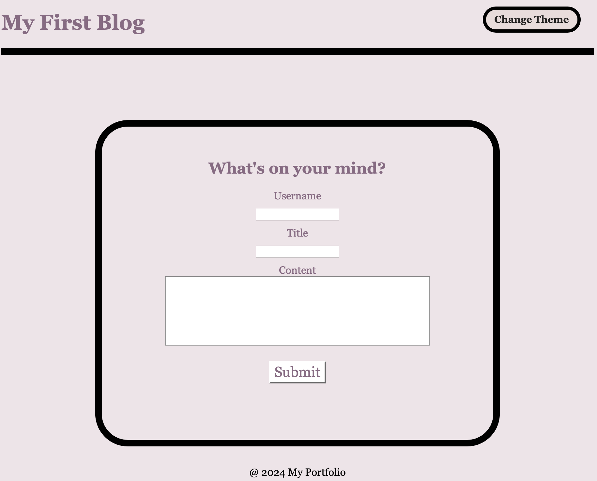

# Personal Blog Website

## Overview
This project is designed as a two-page website for creating and viewing blog posts. It provides a practical application of HTML, CSS, and JavaScript, focusing on forms, local storage, and dynamic DOM manipulation. Users can toggle between light and dark modes for enhanced readability according to their preference.

## Features

### Landing Page
- **Blog Submission Form**: Users can input their username, blog title, and content.
- **Form Validation**: Ensures that all fields are filled before submission.
- **Local Storage**: Submitted posts are stored locally.

### Posts Page
- **View Posts**: Dynamically generated blog posts from local storage.
- **Light/Dark Mode Toggle**: Allows users to switch between themes.
- **Navigation**: Users can navigate back to the submission form to add new posts.

## User Stories

**As a marketing student:**
- I want a personal blog to showcase my thoughts and experiences.

## Acceptance Criteria

- **Landing Page Load**: Present a form with inputs for username, blog title, and blog content.
- **Form Submission**: Store blog post data in local storage and redirect to the posts page.
- **Form Validation**: Display a prompt for missing information in the form fields.
- **Posts Page**: Show a header with theme toggle and a back button.
- **Theme Toggle**: Update page styles based on light/dark selection.
- **Back Navigation**: Redirect to the landing page for new posts.
- **Display Posts**: List blog posts pulled from local storage.
- **Post Details**: View title, content, and author for each blog entry.
- **Footer**: Link to the developer's portfolio.

## Project Structure
```
my-blog
├── assets
│   ├── css
│   │   ├── blog.css
│   │   ├── form.css
│   │   └── styles.css
│   └── js
│       ├── blog.js
│       ├── form.js
│       └── logic.js
├── index.html
├── blog.html
└── README.md
```

## Mock-Up


## Link